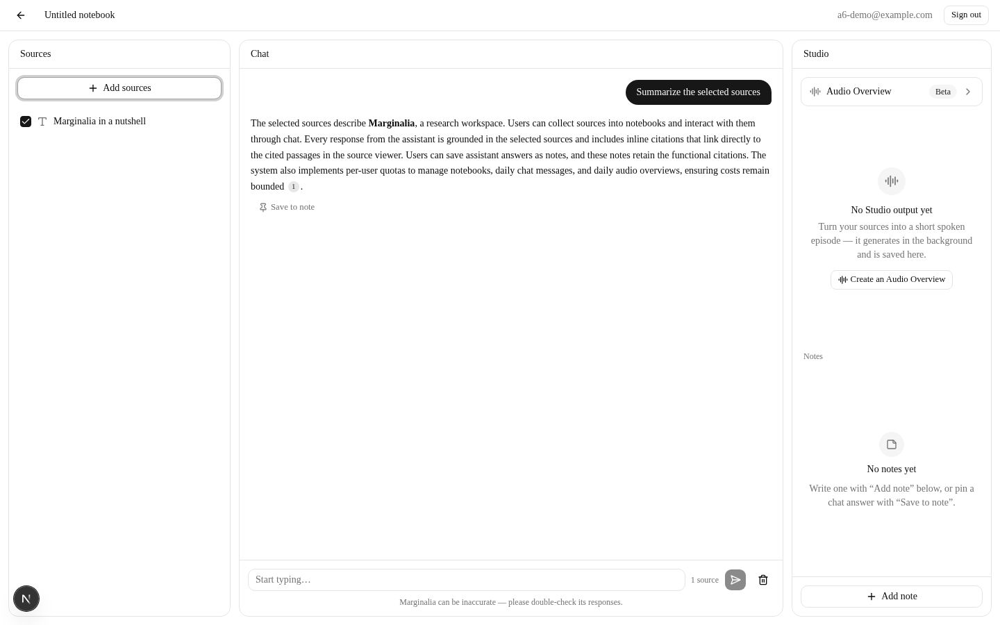
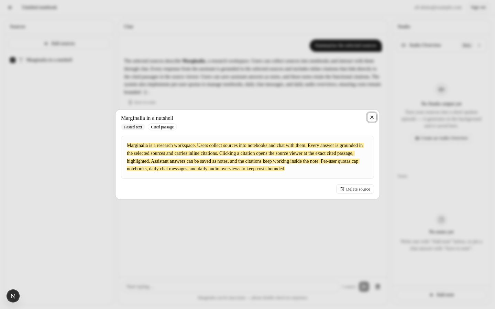
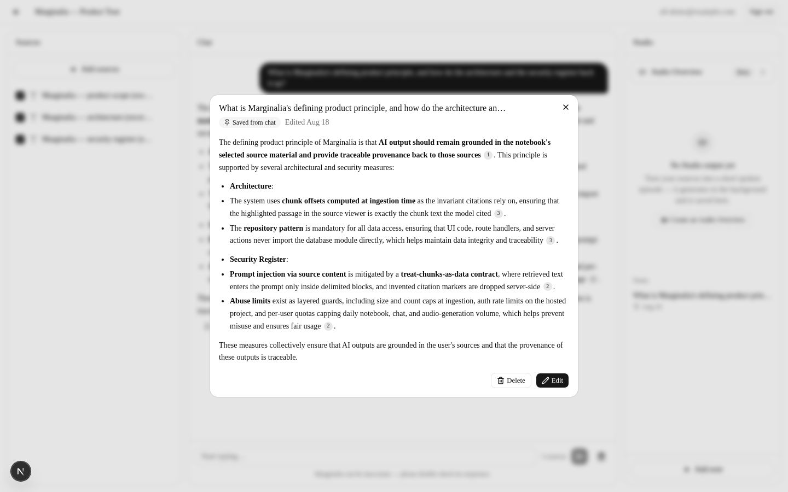

# Marginalia

**A study clone of Gemini Notebook (formerly NotebookLM).** Collect sources
into a notebook — PDFs, text files, pasted notes, web pages — and ask
questions about them. Answers come from the sources you selected and nothing
else, carrying inline citations that open the source at the exact passage each
one came from. (Select no sources and the app tells you so rather than
pretending.) An answer can be saved as a note with its citations still
working, and any notebook can be turned into a spoken **Audio Overview**.

**[Try it → app.mrgnl.eu](https://app.mrgnl.eu)** ·
[Documentation → docs.mrgnl.eu](https://docs.mrgnl.eu) ·
[About → www.mrgnl.eu](https://www.mrgnl.eu)

> Marginalia is an independent demonstration project. It is **not affiliated
> with Google, NotebookLM or Gemini** — the same notice every public page
> carries.



| Click a citation → the source opens at the cited passage | Save an answer → the note keeps working citations |
| --- | --- |
|  |  |

*Screenshots are the verification record of session A6 — see
[`handovers/`](handovers/).*

## How it works

**Ingest** — a PDF, TXT/Markdown file, pasted text or a URL is parsed (PDFs
per page, so chunks keep page numbers; URLs SSRF-guarded and reduced to
article text), split into 400-token chunks that record their exact character
offsets into the source, and embedded into `pgvector`. Size and word limits
are checked *before* embedding, so an oversized source fails without spending
a token.

**Retrieve** — the question is embedded and searched two ways at once, in one
SQL statement: pgvector cosine similarity over an HNSW index, and Postgres
full-text search over a generated `tsvector`. The rankings are fused with
Reciprocal Rank Fusion; the top ten chunks go to the model, restricted to the
sources you ticked and intersected server-side with the notebook's own ready
sources.

**Answer** — streamed token by token. Retrieved chunks enter the prompt only
inside delimited, sanitized blocks that the system prompt pins as quoted data
rather than instructions, and the model has no tools. Citation markers are
mapped **server-side** against the retrieved set, so a citation can never
point at something that was not retrieved — and the character offsets
recorded at ingestion are what let the chip open the viewer on the exact
passage.

**Audio Overview** — the selected sources become a script, the script becomes
speech through Azure's neural voices, and the result lands as a private
artifact you can play, rename, regenerate or download. It runs in the
background; the notebook stays usable.

→ Every model call — which model, where, triggered by what, bounded by which
quota — plus the full RAG trace with its tuning constants is the
[generative view](product/architecture/generative.md). The rest of the design
is the [4+1 architecture views](product/architecture/).

**Stack:** Next.js on Node (Bun for tooling and tests) · Supabase Postgres
with pgvector, auth and storage · Scaleway Generative APIs for chat and
embeddings · Azure AI Speech for TTS · deployed as a Scaleway serverless
container, with the container, DNS, buckets and the hosted Supabase project
provisioned by Terraform · docs and marketing as Astro static sites.

## Built in seven days — and what was cut

Seven days was the plan. Every session on the original board merged inside
the first two; every session added after them was documentation — scope
reconciliation, architecture views, cost modelling, this file.

| | |
| --- | --- |
| **Delivered** | Notebooks, email/password auth, four source kinds, hybrid retrieval, grounded streaming chat, inline citations with source navigation, notes, Audio Overview, per-user quotas, and a deployed environment on a custom domain — [item by item, each with the PR that shipped it and its known limitations](product/target-scope.md). |
| **Cut, deliberately** | Sharing and collaboration, YouTube/Drive/audio ingestion, research modes, mind maps and flashcards, multi-language output, note→source conversion, two-speaker audio, queued job infrastructure, and more — [the full cut list](product/roadmap.md#cut-list-explicitly-out-of-the-7-days). |

Scope was a decision, not an accident, and so were the risks taken with it:
the [security register](product/security.md) records every known concern with
what mitigates it today, whether the residual risk is accepted for a
prototype, and the named trigger that ends that acceptance. One entry is
marked a hard launch blocker.

## How it was built

The work ran as agent sessions. Each had one goal, a written brief naming its
allowed and read-only surfaces, a branch in a git worktree, one pull request,
an independent review, and a handover note. A coordinating **foreman** session
wrote the briefs and reviewed what landed. The **owner** proposed the work,
made the decisions, and was the quality gate.

The code, the documentation and this README were AI-generated. The direction,
the decisions and the reviews were not.

That is checkable rather than assertable. [`handovers/`](handovers/) holds one
note per session — 31 session notes and 3 foreman notes as this was written —
and every change landed through a reviewed pull request, 80 merged so far.
[`product/roadmap.md`](product/roadmap.md) carries a row per session with a
dated owner attribution where a decision shaped it, and
[`product/target-scope.md`](product/target-scope.md) names the PR that shipped
each capability. Three of those rows, as examples of what review actually
changed:

- **The generative architecture view exists because the owner asked which
  models ran where** and no existing document answered it in one place
  (roadmap C9, owner-requested 2026-08-18) —
  [the view](product/architecture/generative.md).
- **The cost page was rejected twice.** First as "stats for nerds" that never
  showed how the bill grows with demand (roadmap C14, owner review
  2026-08-19), then as legible but not readable — tables that asked the reader
  to do arithmetic the page should have done (roadmap C15, owner review
  2026-08-20). It now states a cost per user per month:
  [Marginalia in numbers](product/in-numbers.md).
- **Review caught real defects, in both directions.** A cross-lane lint break
  gated CI for half a wave and was found by an unrelated session, then fixed
  in [its own PR](https://github.com/DonHeidi/notebooklm-clone/pull/35) rather
  than by a drive-by ([A7](handovers/2026-08-18-session-a7-test-postgres.md));
  session C14 corrected a per-chunk storage figure an earlier session had put
  on the cost page at roughly 2.4× optimistic
  ([C11, annotated](handovers/2026-08-18-session-c11-in-numbers.md)); and the
  scope table was re-baselined because the owner judged it was *under*selling
  a finished product (roadmap C13).

The fuller account — what the parallelism delivered, and where it rubbed — is
[`product/history/process.md`](product/history/process.md).

## Run it yourself

**Prerequisites:** [mise](https://mise.jdx.dev) (pins Bun, the Supabase CLI
and Terraform — see [`mise.toml`](mise.toml)) and Docker, for the local
Supabase stack.

```bash
git clone https://github.com/DonHeidi/notebooklm-clone.git
cd notebooklm-clone
bun install
mise exec -- supabase start          # Postgres + pgvector + auth + storage; applies supabase/migrations
```

`supabase start` prints an anon key and a service-role key. Put those two into
an untracked `.env.local` at the repo root — they are the only values a local
run needs; every other required variable already has a local default.
[`.env.schema`](.env.schema) declares every variable in the project and is
committed; the values never are, and live in a password manager instead.
Env-dependent commands run through varlock:

```bash
bunx varlock run -- bun test         # 154 tests across 19 files
bunx varlock run -- bun run dev:webapp   # http://localhost:3000
```

Verified end to end on a fresh worktree with exactly those two values in
`.env.local`: the suite passes and the app serves. What runs is signup, login
and notebooks — anything that calls a model (embedding a source, answering a
chat message, generating an Audio Overview) additionally needs your own
Scaleway Generative APIs and Azure AI Speech credentials. The schema
documents them.

> **Known flake:** on some machines a `beforeEach` hook in
> `artifact-repository.test.ts` intermittently times out locally, which aborts
> the rest of that file (`150 tests` instead of `154`). Re-run it. CI, which
> runs the suite against an isolated pgvector container, has never seen it —
> CI is the authoritative signal.

## Repository map

| Path | What |
| --- | --- |
| [`apps/webapp`](apps/webapp) | The product: Next.js fullstack app, Node runtime in production |
| [`apps/docs`](apps/docs) | Astro static site rendering `product/` and `handovers/` → docs.mrgnl.eu |
| [`apps/marketing`](apps/marketing) | Astro static marketing site → www.mrgnl.eu |
| [`infrastructure`](infrastructure) | Terraform: Scaleway container, DNS, buckets, hosted Supabase |
| [`supabase`](supabase) | Migration timeline, RLS and storage policies, local stack config |
| [`product`](product) | Research catalog, target scope, roadmap, architecture views, feasibility decisions, security register, costs, history |
| [`handovers`](handovers) | One note per session — what was done, verified, and left open |
| [`AGENTS.md`](AGENTS.md) | Conventions every session follows (also `CLAUDE.md`, and one per workspace) |
